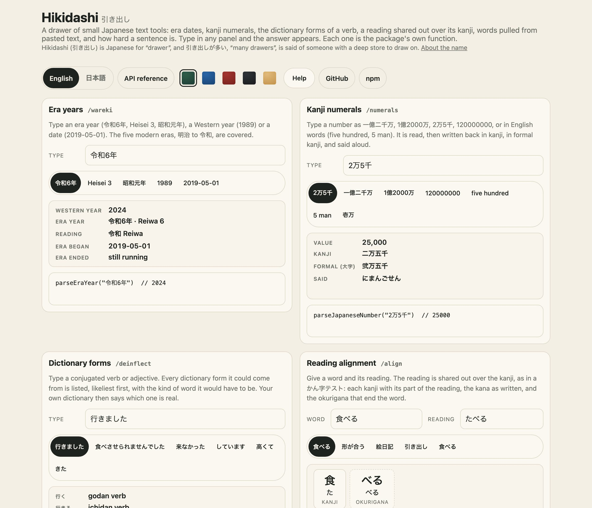
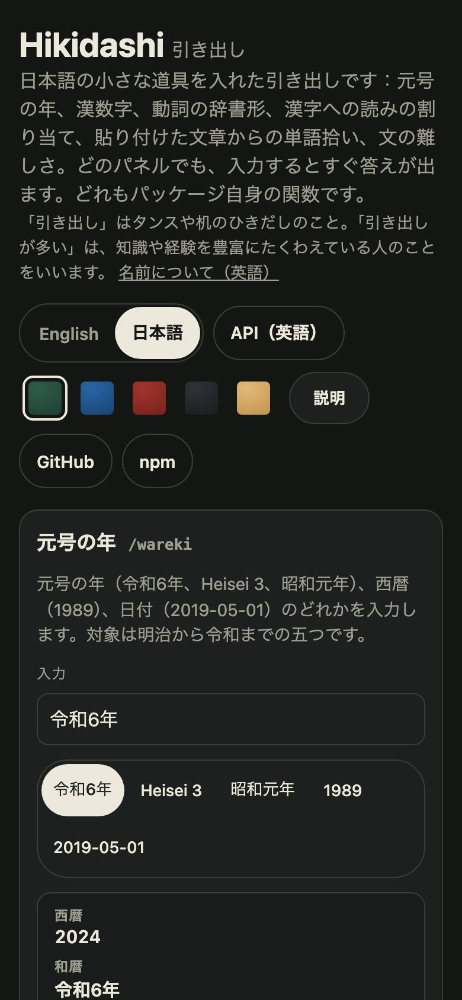

<h1 align="center">Hikidashi <sub>引き出し</sub></h1>

<p align="center"><strong>A drawer of small Japanese text tools for JavaScript and TypeScript.</strong><br>
Era dates (和暦) and kanji numerals both ways, the dictionary forms a conjugated verb or adjective could come from, a word's reading shared out over its kanji (かん字テスト), Japanese words and kanji pulled out of pasted text, and how hard a sentence is to read. Pure functions with no data of their own. No dependencies.</p>

<p align="center">
  <a href="https://github.com/johnmorrisdotca/hikidashi/actions/workflows/ci.yml"></a>
  <a href="https://www.npmjs.com/package/@johnmorrisdotca/hikidashi"></a>
  <a href="./LICENSE"></a>
  
</p>

<p align="center"><a href="https://johnmorrisdotca.github.io/hikidashi/"><strong>Try the drawers →</strong></a> · <a href="https://johnmorrisdotca.github.io/hikidashi/api.html">API reference</a></p>

<p align="center">
  
  
</p>

Hikidashi is the handful of Japanese-text helpers a study tool, a worksheet maker or a reading aid ends up writing for itself, taken out and tested once: what year is 平成3年, how is 一億二千万 written in digits, which verb is 食べませんでした, how does たべる divide over 食べる. It is a drawer of them, each small and each its own import, so a page that wants one era converter does not carry the rest. It was taken out of UmaKuma, a Japanese study app by the same author, and it works in [the demo](https://johnmorrisdotca.github.io/hikidashi/) with nothing to install.

## In 30 seconds

```sh
npm install @johnmorrisdotca/hikidashi
```

```ts
import { dictionaryForms, parseEraYear, parseJapaneseNumber, segmentWord, writeJapaneseNumber } from "@johnmorrisdotca/hikidashi";

parseEraYear("令和6年")?.westernYear;             // 2024
parseJapaneseNumber("2万5千");                    // 25000
writeJapaneseNumber(120_000_000);                // "一億二千万"
dictionaryForms("食べませんでした")[0];            // { base: "食べる", wordClass: "ichidan" }
segmentWord("形が合う", "かたちがあう");           // 形 かたち · が · 合 あ · う (okurigana)
```

Or take only the drawer you need:

```ts
import { eraOnDate } from "@johnmorrisdotca/hikidashi/wareki";

eraOnDate("1989-01-07");   // 昭和64: the next day, 1989-01-08, is 平成1
```

## Who it is for

- **Language-learning tools** that read what a learner pastes in or types, and want 行きます to be 行く and 一億二千万 to be a number.
- **Teachers' worksheets and test makers**, who need a reading divided over its kanji, the okurigana in brackets, and a test that is the same one for the same seed.
- **Reading aids and forms**, which meet 令和6年 and 昭和64年 and need the Western year, or the era, from a date.
- **Anyone who wants the logic without the data**: every drawer takes your own dictionary, grades and lists as an argument, so there is nothing to keep up to date here.

## Features

- **Era years both ways (和暦).** Five modern eras, 明治 to 令和. 令和6年, Heisei 3 and 昭和元年 to a Western year, and a Western year or a day back to its era year, with 元年 read and written, and the years an era changed in answered with both eras.
- **Kanji numerals both ways (漢数字).** 一億二千万, 1億2000万, 2万5千 and 120000000 to a number, and a number back to kanji, to the largest safe integer. Also in the formal 大字 contracts and banknotes use (壱万), read aloud in hiragana with the sound changes (さんびゃく), and English words and romaji (`five hundred`, `5 man`) read too.
- **Dictionary forms (活用).** From a conjugated form to every dictionary form it could come from, with the kind of word it would have to be: godan and ichidan verbs, i-adjectives, する and 来る, in the polite, negative, past, te, conditional, volitional, passive, causative and potential forms and chains of them.
- **Reading alignment (読みの割り当て).** A word and its reading cut into kanji, kana and okurigana, each kanji with its share of the reading, and a seeded かん字テスト of writing and reading questions built from a list.
- **Pasted-text extraction (抽出).** The words your dictionary knows, in dictionary form and longest match first, and every kanji, from text of any length, with a cap on what it will read and every control character dropped.
- **Sentence difficulty (難しさ).** A score from a sentence's length and its hardest kanji, from the school grades or frequency ranks you hold, so the easiest example sentence can lead.
- **No data and no dependencies.** No dictionary, no word list, no grade table and no network request. Every function is pure and returns new values.
- **English and Japanese demo**, with a Help switch that explains each option.

## Use it in your project

### 1. A drawer on a server or in an app

```ts
import { parseJapaneseNumber } from "@johnmorrisdotca/hikidashi/numerals";

parseJapaneseNumber(form.amount);   // a number, or null when it is not one
```

Each drawer is an entry of its own (`/wareki`, `/numerals`, `/deinflect`, `/align`, `/extract`, `/difficulty`), so a bundler keeps only what is imported, and the main entry has them all. The package is ES modules with `sideEffects: false`; on Node 22.12 or later it loads by `require` too.

### 2. In a page, with no bundler

```html
<script type="module">
  import { eraYearsOf } from "https://cdn.jsdelivr.net/npm/@johnmorrisdotca/hikidashi@1/dist/wareki.js";
  console.log(eraYearsOf(2019).map((one) => `${one.era.kanji}${one.year}`));   // ["令和1", "平成31"]
</script>
```

### What a developer gets

- **Typed results**, with a doc comment on every export. Every function is pure: it returns new values and never changes what it was given.
- **Refusal rather than a guess.** A text that is not a number, a year an era never had, a reading that does not fit its word: each gives `null` or an empty list, never a plausible wrong answer.
- **No dependencies.** One entry for each drawer.
- **Where it runs.** See [Browser and runtime support](#browser-and-runtime-support).

## The drawers

### Era years: `/wareki`

```ts
import { eraOnDate, eraYearOf, eraYearsOf, formatEraYearJapanese, parseEraYear } from "@johnmorrisdotca/hikidashi/wareki";

parseEraYear("Heisei 3")?.westernYear;                    // 1991
parseEraYear("令和元年")?.westernYear;                     // 2019
eraYearsOf(1989).map((one) => `${one.era.kanji}${one.year}`);   // ["平成1", "昭和64"]: both are right
eraOnDate("1989-01-07");                                  // 昭和64
eraOnDate("1989-01-08");                                  // 平成1
formatEraYearJapanese(eraYearOf(2019)!, { gannen: true }); // "令和元年"
```

| Era | Reading | First day | Last day | Years |
| --- | --- | --- | --- | --- |
| 明治 Meiji | めいじ | 1868-10-23 | 1912-07-29 | 1 to 45 |
| 大正 Taisho | たいしょう | 1912-07-30 | 1926-12-24 | 1 to 15 |
| 昭和 Showa | しょうわ | 1926-12-25 | 1989-01-07 | 1 to 64 |
| 平成 Heisei | へいせい | 1989-01-08 | 2019-04-30 | 1 to 31 |
| 令和 Reiwa | れいわ | 2019-05-01 | still running | 1 to 99 |

An era changes partway through a Western year, so five years belong to two eras: 1912, 1926, 1989 and 2019 each begin one and end another. `eraYearsOf` answers with both, newest first; `eraYearOf` the newest, which is how the year is usually written; `eraOnDate` says which a day is in, from `YYYY-MM-DD` or a `Date`. Era years restart from 元年 on the first of January, as years are counted today. 明治 is dated from 23 October 1868, when the name was proclaimed, and its years are counted as if it began with 1868. All dates are in the Gregorian calendar. A year an era never reached (昭和65), a day that is not on the calendar and anything before 明治 give `null`. `parseEraYear` reads kanji or Latin names, any romanization (Showa, Shouwa, Shōwa), full-width digits, with or without 年.

### Kanji numerals: `/numerals`

```ts
import { parseEnglishNumber, parseJapaneseNumber, readJapaneseNumber, writeJapaneseNumber } from "@johnmorrisdotca/hikidashi/numerals";

parseJapaneseNumber("1億2000万");              // 120000000
parseJapaneseNumber("2万5千");                 // 25000
writeJapaneseNumber(120_000_000);              // "一億二千万"
writeJapaneseNumber(10_000, { formal: true }); // "壱万"
readJapaneseNumber(800);                       // "はっぴゃく"
parseEnglishNumber("5 man");                   // 50000
```

Japanese counts in ten-thousands (万, 億, 兆, each 10,000 times the last), which is why 120 million is 一億二千万, "twelve thousand ten-thousands". The reader takes kanji, digits (half-width or full-width) and any mixture, a thousands comma, the formal numerals 壱 弐 参 拾 and the old 萬, and refuses what is not a number: units must descend (万億), kanji digits do not sit side by side (一二三), and a bare 万 is not a number. The writer drops the one where the language does (十, not 一十) and keeps it where it does not (一万). `readJapaneseNumber` says the number in hiragana: 三百 is さんびゃく, 六百 ろっぴゃく, 八千 はっせん, 一兆 いっちょう. Whole numbers from 0 to 9,007,199,254,740,991 only; past that JavaScript stops counting exactly, so it answers `null` and never a number a digit out.

### Dictionary forms: `/deinflect`

```ts
import { dictionaryForms, wordClassesOf } from "@johnmorrisdotca/hikidashi/deinflect";

dictionaryForms("食べませんでした");
// [{ base: "食べる", wordClass: "ichidan" }, { base: "食ぶ", wordClass: "godan" }, …]
wordClassesOf("行く", ["v5k-s", "vi"]);       // ["godan"], from JMdict's tags
```

A sentence writes 行きます where a dictionary lists 行く. `dictionaryForms` walks a written form back through its endings, one at a time, and answers with every dictionary form it could be a conjugation of, likeliest first, each with the kind of word it would have to be (`godan`, `ichidan`, `iAdjective`, `suru`, `kuru`). It *proposes*: 食べる is also the potential of a verb 食ぶ that does not exist, so a caller keeps only the answers its own dictionary confirms are that kind of word, which is what `wordClassesOf` is for (it reads plain labels such as `"godan verb"` and JMdict's tags such as `v5k`). There is deliberately no rule that reads a bare stem as its verb: 東京行き is a noun, and 行き is a verb only when an ending follows it. Covered: the polite, negative, past, te, conditional, volitional, passive, causative and potential forms and chains of them (食べさせられませんでした), する and 来る (and 来る in kana, after kana: 持ってきた). Not covered: the imperative, keigo verbs, and な adjectives, which do not conjugate onto themselves.

### Reading alignment: `/align`

```ts
import { buildKanjiTest, segmentWord } from "@johnmorrisdotca/hikidashi/align";

segmentWord("形が合う", "かたちがあう");
// [{ text: "形", kind: "kanji", reading: "かたち" }, { text: "が", kind: "kana", reading: "が" },
//  { text: "合", kind: "kanji", reading: "あ" }, { text: "う", kind: "okurigana", reading: "う" }]
buildKanjiTest(words, { seed: 7, count: 12 });   // { writing: [...], reading: [...] }, the same test for the same seed
```

A Japanese school's かん字テスト shows a reading beside empty squares and asks for the kanji, and the okurigana that end the word are written in brackets under them. The kana in a word are anchors in its reading, which is what lets the rest be shared out over the kanji: 形が合う read かたちがあう is 形 (かたち), が, 合 (あ), う. A compound of several kanji (絵日記, えにっき) is one segment, since a reading cannot be split between kanji without a dictionary. The reading may be katakana. `segmentWord` is `null` when the reading does not fit, so a test leaves the word out rather than mark a wrong answer right. `kanjiAsWord` turns a kanji and its dictionary readings (た.べる) into a word to ask. `buildKanjiTest` makes a writing half and a different reading half from a list, shuffled by a seed (mulberry32) so the test on paper is the test on screen. The shared `katakanaToHiragana` and `hiraganaToKatakana` are exported beside it.

### Pasted text: `/extract`

```ts
import { extractFromText, wordCandidates } from "@johnmorrisdotca/hikidashi/extract";

const known = new Map([["先生", []], ["学校", []], ["行く", ["godan"]]]);
extractFromText({ text: "先生と学校へ行きます", known });
// { words: ["先生", "学校", "行く"], kanji: ["先", "生", "学", "校", "行"], stats: { characters: 10, … } }
```

Somebody pastes a page of a book, a handout or a chat message and wants the words and kanji out of it. The text is never stored and never trusted for its length: it is cut to `EXTRACT_LIMITS.characters`, control and invisible characters are dropped, and what comes back is not the text but the words your dictionary recognised and single kanji. `known` is a `Map` from each word to the kinds of word it is, from your own dictionary; the package has none. Words match longest first, a conjugated verb or adjective is returned as the dictionary form `known` lists (行きます is 行く, never the noun 行き, unless an ending that only a verb takes follows it), and every kanji is taken whether or not it belongs to a word. `wordCandidates` lists every substring a dictionary might know, capped, so a page can ask its database once about a whole paste and pass the answers as `known`. 々 and 〇 are not counted as kanji.

### Sentence difficulty: `/difficulty`

```ts
import { kanjiCost, sentenceDifficulty } from "@johnmorrisdotca/hikidashi/difficulty";

const costs = new Map([["水", kanjiCost({ grade: 1, frequencyRank: 223 })], ["飲", kanjiCost({ grade: 3, frequencyRank: 969 })]]);
sentenceDifficulty("水を飲む。", costs);   // 14: five characters and three times the hardest kanji's 3
```

Two things make a sentence hard: how long it is, and the hardest character in it. The score is its length plus three times its hardest kanji's cost, so a kana-only sentence scores its length and sorts first, and one unknown character weighs as much as ten. `kanjiCost` turns what you hold about a kanji into a cost: grades 1 to 6 cost their own number, grade 8 (the rest of the jōyō kanji) costs 9, name kanji 14, an ungraded kanji costs by its frequency rank, up to 18, and a kanji you know nothing about costs 20 (`UNKNOWN_KANJI_COST`). The grades and ranks are in KANJIDIC2 and other kanji databases; none is shipped here.

## API

The [API reference](https://johnmorrisdotca.github.io/hikidashi/api.html) lists every export of every entry point with its signature and its doc comment. It is made from the source by `pnpm site`, so it cannot fall behind the code.

| Entry | Exports |
| --- | --- |
| `@johnmorrisdotca/hikidashi/wareki` | `JAPANESE_ERAS`, `parseEraYear`, `westernYearFor`, `eraYearsOf`, `eraYearOf`, `eraOnDate`, `formatEraYearJapanese`, `formatEraYearRomaji`, and the types `JapaneseEra` and `EraYear` |
| `@johnmorrisdotca/hikidashi/numerals` | `parseJapaneseNumber`, `writeJapaneseNumber`, `readJapaneseNumber`, `parseEnglishNumber`, `LARGEST_JAPANESE_NUMBER` |
| `@johnmorrisdotca/hikidashi/deinflect` | `dictionaryForms`, `wordClassesOf`, `followsAsVerbStem`, `WORD_CLASSES`, `LONGEST_ENDING`, and the types `WordClass` and `Deinflection` |
| `@johnmorrisdotca/hikidashi/align` | `segmentWord`, `kanjiAsWord`, `buildKanjiTest`, `katakanaToHiragana`, `hiraganaToKatakana`, `SEGMENT_KINDS`, `ALIGN_LIMITS`, and the types `WordSegment`, `ReadWord`, `KanjiTest` and `KanjiTestQuestion` |
| `@johnmorrisdotca/hikidashi/extract` | `extractFromText`, `wordCandidates`, `sanitizePastedText`, `EXTRACT_LIMITS`, and the types `KnownWords`, `ExtractInput` and `ExtractResult` |
| `@johnmorrisdotca/hikidashi/difficulty` | `kanjiCost`, `kanjiIn`, `sentenceDifficulty`, `UNKNOWN_KANJI_COST`, and the type `KanjiDifficultySource` |
| `@johnmorrisdotca/hikidashi` | all of the above, from one import |

Every function is pure: it returns new values and never changes what it was given. Anything that is not text where text is expected is refused, not thrown at.

## Limits

All of these are held by tests, and the ones with a name are exported.

| Limit | Value | Where |
| --- | --- | --- |
| Eras | the five modern eras, 明治 (1868) to 令和; nothing before | `JAPANESE_ERAS` |
| Years of the era still running | 1 to 99 | `eraYearsOf`, `westernYearFor` |
| Numbers | whole numbers from 0 to 9,007,199,254,740,991 | `LARGEST_JAPANESE_NUMBER` |
| A pasted text | read to 20,000 characters, then cut, and `stats.truncated` says so | `EXTRACT_LIMITS.characters` |
| The longest word matched | 8 characters, and the ending a sentence can put on it | `EXTRACT_LIMITS.wordLength`, `LONGEST_ENDING` |
| Candidates asked of a dictionary | 4,000 | `EXTRACT_LIMITS.candidates` |
| A word to align | 64 characters; its reading 256 | `ALIGN_LIMITS` |
| A conjugation chain | 5 endings deep | `dictionaryForms` |

The matching is bounded, not exponential: a word of repeated kana that no reading fits is refused in no time, and a paste of the longest length is read in a moment.

## Languages

The functions answer in kanji, kana and numbers, so they have no words of their own to translate. The demo is in English and Japanese, chosen by its own chooser, taking the browser's language on a first visit. **Japanese: included; not yet reviewed by a native reader. Corrections welcome.** Every line of the demo is listed beside its English in [docs/strings-ja.md](./docs/strings-ja.md), and there is an [issue template](https://github.com/johnmorrisdotca/hikidashi/issues/new?template=fix-a-translation.md) for fixing one.

## Browser and runtime support

Nothing here touches the DOM, the network or the file system, so the package runs anywhere JavaScript does: Node 22 or later (CI tests 22 and 24, on Linux, macOS and Windows), and any browser with ES2020 modules and Unicode property escapes in regular expressions (`\p{Script=Han}`): Chrome and Edge 80, Safari 13.1, Firefox 78, all from 2020 on. The demo is played in a real Chromium at a phone's width (with touch) and a desk's, and in WebKit, Safari's engine, at a phone's width; Firefox is not in that run. Deno and Bun are not tested.

## Roadmap

Not here yet, and each welcome as an [issue](https://github.com/johnmorrisdotca/hikidashi/issues):

- The imperative form, and keigo, in the dictionary forms.
- Positional numerals with several non-zero digits (二〇二四), which kanji numerals use for years and which are refused today (二〇 and 一〇〇 are read).
- Era names before 明治.

Left out on purpose: any dictionary, word list or grade table, which would need keeping up to date and has its own licence; and any network request.

## Architecture

Each drawer is a plain module with no DOM, and an entry of its own in `package.json`, so a bundler keeps only what a page imports. The drawers share nothing but the two kana converters, and `deinflect` is used by `extract`.

```text
src/
├── index.ts            the main entry: every drawer
├── wareki.ts           era years and dates, both ways: the "/wareki" entry
├── numerals.ts         kanji numerals, read, written and said aloud: the "/numerals" entry
├── englishNumbers.ts   numbers in English words and romaji, read by "/numerals"
├── deinflect.ts        the dictionary forms of a conjugated word: the "/deinflect" entry
├── align.ts            a reading shared out over its kanji, and a kanji test: the "/align" entry
├── extract.ts          words and kanji pulled out of pasted text: the "/extract" entry
├── difficulty.ts       what a kanji costs and how hard a sentence is: the "/difficulty" entry
├── kana.ts             hiragana and katakana into each other
└── version.ts          the package's version
```

Tests sit beside the code they test (`*.test.ts`). `scripts/` builds the demo and its API reference page, takes the README's pictures and checks the package as npm packs it; `demo/` is the page, and `e2e/` its browser tests.

## The name

*Hikidashi* (引き出し) is Japanese for a "drawer": the sliding box in a desk or a chest. It is the noun of the verb 引き出す (*hikidasu*), "to pull out", and the same word means a withdrawal from a bank. 引き出しが多い (*hikidashi ga ōi*), "to have many drawers", is the compliment for somebody with a deep store of knowledge, experience and things to say, all within reach to draw on. This package is that: a drawer of small tools, each one pulled out when wanted. ([Wiktionary: 引き出し](https://en.wiktionary.org/wiki/引き出し), which gives "drawer" and "withdrawal"; the idiom is explained by Japanese writers such as [ダイヤモンド・オンライン](https://diamond.jp/articles/-/318222), for whom it is a person's stock of experience they can bring out in conversation.)

It is a supplement to a larger product, not the product, which is why it is named for a drawer.

## Where it comes from, and where it is used

Hikidashi was built for UmaKuma, a Japanese study app by the same author, and its functions are the ones that app had written, tested and kept for itself: era years for dates on a form, kanji numerals for amounts in a headline, dictionary forms so that a pasted sentence gives 行く and not 行き, a reading shared out over its kanji for a worksheet, and the cost of a sentence so the easiest example comes first. They were pure, so they came out whole.

### Used by

- UmaKuma, a Japanese study app by the same author.

Using Hikidashi in something? Open an *Add my project* issue and we will add you.

### The family

<!-- family:start (made by scripts/family-readme.mjs from scripts/family-template.mjs; change those, not this) -->
Hikidashi is one of twenty-four packages, each made for the same site, each at
[github.com/johnmorrisdotca](https://github.com/johnmorrisdotca). The code of every one is MIT.

- [Korokoro](https://github.com/johnmorrisdotca/korokoro) (コロコロ): dice, with notation, exact odds, real sounds and the dice of many games. [Demo](https://johnmorrisdotca.github.io/korokoro/).
- [Kyuubu](https://github.com/johnmorrisdotca/kyuubu) (キューブ): a turning cube for the browser, 2×2 to 7×7, with record solves to replay. [Demo](https://johnmorrisdotca.github.io/kyuubu/).
- [Hitotsu](https://github.com/johnmorrisdotca/hitotsu) (一つ): a colour-card shedding game for two to eight, with the house rules people play. [Demo](https://johnmorrisdotca.github.io/hitotsu/).
- [Toranpu](https://github.com/johnmorrisdotca/toranpu) (トランプ): a deck of playing cards, card games with computer players, and solitaires. [Demo](https://johnmorrisdotca.github.io/toranpu/).
- [Tane](https://github.com/johnmorrisdotca/tane) (種): seeded random numbers and daily seeds, the same in every browser and on every server. [Demo](https://johnmorrisdotca.github.io/tane/).
- [Narabe](https://github.com/johnmorrisdotca/narabe) (並べ): one rules engine for abstract board games, from gomoku and Reversi to Go and checkers. [Demo](https://johnmorrisdotca.github.io/narabe/).
- [Tenka](https://github.com/johnmorrisdotca/tenka) (天下): world conquest for two to six, on a map of the real world. [Demo](https://johnmorrisdotca.github.io/tenka/).
- [Kumimoji](https://github.com/johnmorrisdotca/kumimoji) (組み文字): a crossword tile race, in English and Japanese kana. [Demo](https://johnmorrisdotca.github.io/kumimoji/).
- [Tsunagi](https://github.com/johnmorrisdotca/tsunagi) (繋ぎ): a line-joining logic puzzle whose every level has exactly one answer. [Demo](https://johnmorrisdotca.github.io/tsunagi/).
- [Jarajara](https://github.com/johnmorrisdotca/jarajara) (ジャラジャラ): mahjong tiles drawn as SVG, stacked layouts, and the matching solitaire Awase. [Demo](https://johnmorrisdotca.github.io/jarajara/).
- [Suido](https://github.com/johnmorrisdotca/suido) (水道): a pipe puzzle: turn the pieces until the water reaches every drain. [Demo](https://johnmorrisdotca.github.io/suido/).
- [Domino](https://github.com/johnmorrisdotca/domino) (ドミノ): dominoes and Mexican Train. [Demo](https://johnmorrisdotca.github.io/domino/).
- [Kotoba](https://github.com/johnmorrisdotca/kotoba) (言葉): word lists and word-game rules in English, French, German and Japanese. [Demo](https://johnmorrisdotca.github.io/kotoba/).
- [Sugoroku](https://github.com/johnmorrisdotca/sugoroku) (双六): backgammon and its variants, with the doubling cube and match play. [Demo](https://johnmorrisdotca.github.io/sugoroku/).
- [Kazu](https://github.com/johnmorrisdotca/kazu) (数): grid number puzzles: Sudoku and its variants, Futoshiki and Skyscrapers. [Demo](https://johnmorrisdotca.github.io/kazu/).
- [Meikyuu](https://github.com/johnmorrisdotca/meikyuu) (迷宮): mazes on squares, hexagons, triangles and circles, made from a seed and drawn through with a finger or the mouse. [Demo](https://johnmorrisdotca.github.io/meikyuu/).
- [Hikidashi](https://github.com/johnmorrisdotca/hikidashi) (引き出し): a drawer of small Japanese text tools: era dates, kanji numerals, readings and sentence difficulty. [Demo](https://johnmorrisdotca.github.io/hikidashi/).
- [Chizu](https://github.com/johnmorrisdotca/chizu) (地図): maps of the world and of countries' regions, in English and Japanese, with a quiz and callouts. [Demo](https://johnmorrisdotca.github.io/chizu/).
- [Bushu](https://github.com/johnmorrisdotca/bushu) (部首): find a kanji by the parts it is made of. [Demo](https://johnmorrisdotca.github.io/bushu/).
- [Tobiishi](https://github.com/johnmorrisdotca/tobiishi) (飛び石): peg solitaire with nine boards and seeded solvable challenges. [Demo](https://johnmorrisdotca.github.io/tobiishi/).
- [Jirai](https://github.com/johnmorrisdotca/jirai) (地雷): minesweeper on shaped grids with verified no-guess boards. [Demo](https://johnmorrisdotca.github.io/jirai/).
- [Gunjin](https://github.com/johnmorrisdotca/gunjin) (軍人): five hidden-rank strategy games with pass-the-device play. [Demo](https://johnmorrisdotca.github.io/gunjin/).
- [Karakuri](https://github.com/johnmorrisdotca/karakuri) (からくり): eight hyper-casual puzzle games, some of them physics: draw a shield, pull pins, cut ropes, slide blocks, pour tubes. [Demo](https://johnmorrisdotca.github.io/karakuri/).
- [Houseki](https://github.com/johnmorrisdotca/houseki) (宝石): gem and stone matching puzzles: falling triplets, stone collapse, colour chains and gem swap. [Demo](https://johnmorrisdotca.github.io/houseki/).

**This package is Hikidashi.** The demos of all twenty-four share one header and footer, so each links the rest.
<!-- family:end -->

## Development

```sh
pnpm install
pnpm check          # lint, types and every test
pnpm test:package   # pack, install and import it as somebody who installed it would
pnpm test:demo      # build the demo and play it in a real browser, at a phone's width and a desk's
pnpm site           # build the demo into site/, as the Pages workflow publishes it
pnpm pictures       # take the README's two pictures from the built demo
pnpm docs:make      # rewrite docs/strings-ja.md after changing a word of the demo
```

## Contributing

See [CONTRIBUTING.md](./CONTRIBUTING.md). The commands are under [Development](#development).

Please follow the [code of conduct](./CODE_OF_CONDUCT.md). Text that makes a function run for a very long time is for the [security policy](./SECURITY.md), not a public issue.

## Changes

See [CHANGELOG.md](./CHANGELOG.md).

## Licence

MIT, © John Morris. The package is code only and ships no data. The demo's one small table (the school grade of thirty-odd kanji, typed in to show `kanjiCost`) is credited in [NOTICE.md](./NOTICE.md), and is not part of the published package.
